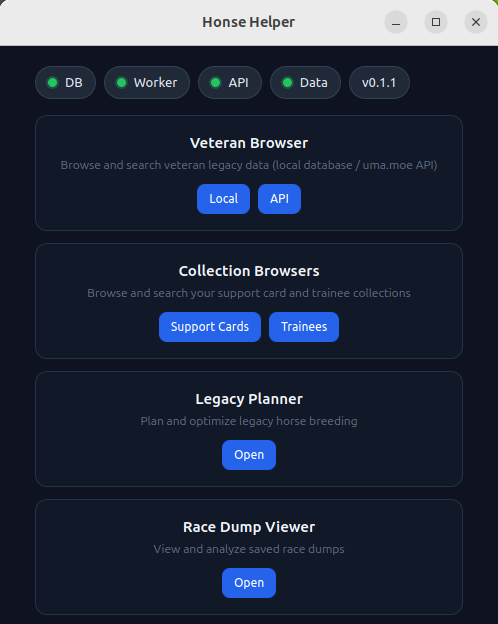

# Main App Window

The main window is the hub of the app, from which you can access all other windows and features.

In the header there are clickable status indicators that show the current status of the app:

## DB status

The database status indicator shows the current status of the game database synchronization.
In tested environments, the app auto-discovers the database location and automatically
synchronizes with it on every launch.

If there is a problem with the database discovery or synchronization, you can click the indicator
to open the DB status window. There you can manually configure the game database location
or manually force a database synchronization.

The DB window also shows the current size of the app database.

## Worker status

It shows the current status of the `honse-worker` sidecar process.

On every app launch, the app launches the sidecar which tries to connect to the running game
process. By default the worker retries connecting to the game process 10 times with a 10s delay,
after which time the worker process exits.

If you need to restart the worker process and rediscover the game process, you can do so
from the worker status page which can be opened by clicking on the indicator.

## API status

Honse-helper can be configured to use an [uma.moe](https://uma.moe) API key to access
its trainers database. To use the API, you need to create an account on uma.moe
and generate an API key.

After saving, the encrypted API key is stored and used to access the uma.moe API.

## Data status

Honse-helper uses supplementary data which is not recoverable directly from the game
database. Currently these are:
- support card events
- trainee and character events

The status of supplementary data is shown on each app launch, but the synchronization
is not done automatically. To synchronize the data from the [online source](https://github.com/MikeTheMaverick428/HonseHelperSupplement), open the supplementary data window and click the 'Sync' button.