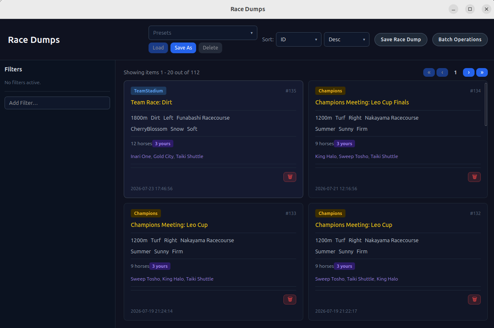
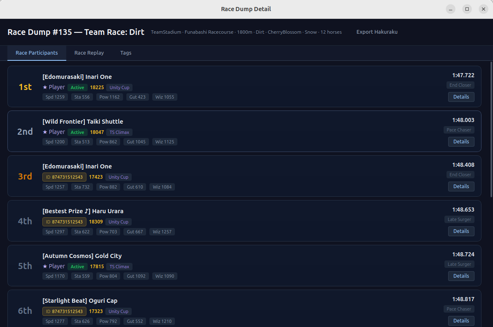
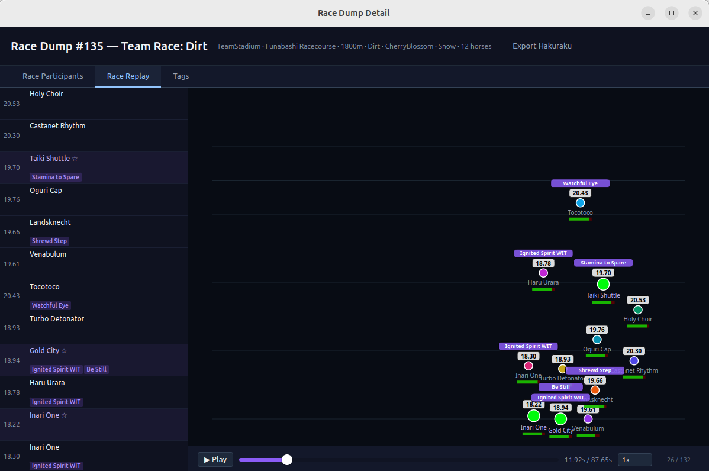
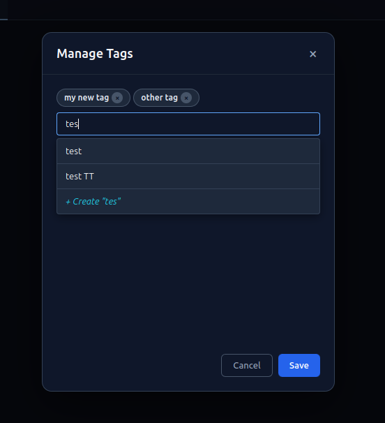

# Race Dump Viewer

Gather, view and analyze saved race dumps from your game sessions. Each race dump captures a snapshot of a completed race including all participants, results, and a frame-by-frame replay.

## Gathering Races

Use the **Save Race Dump** button in the header to trigger the sidecar process to capture currently loaded race from the running game. The gathered data includes participant stats, finish positions, track conditions, and replay frames.

> Your game should be on the next view after paddock view with all participants - either
  during the race or after the race has ended. 

The view comprises:
- **Header** — sorting selector, presets manager, Save Race Dump button, and Batch Operations button
- **Side panel** — filter panel with active filter chips and new filter forms
- **Main panel** — grid of race dump cards with pagination

## Race Dump Card

Each card shows a summary of the captured race:

- **Race type badge** — color-coded badge indicating the race category:
  - **Champions** — Champions Meeting (PvP)
  - **Single** — single-player race
  - **RoomMatch** — room match
  - **TeamStadium** — Team Stadium event
- **ID** — internal database identifier
- **Race name** — the name of the race event (if available)
- **Track info** — distance (meters), ground type (Turf/Dirt), turn direction (Right/Left), track name
- **Conditions** — season, weather, and ground condition (Firm/Good/Soft/Heavy)
- **Participant count** — total number of horses, with a badge showing how many are yours
- **Player participant names** — names of the player-controlled horses
- **Tags** — up to 3 tag pills shown inline, with a `+N` overflow indicator for additional tags
- **Delete button** — removes the race dump from the database
- **Capture time** — when the race was recorded

Clicking a card opens the detailed race dump view.

## Race Dump Detail

The detail view provides in-depth analysis of a single race dump with three tabs:

### Participants Tab

A table showing detailed information for each horse in the race. Columns include:

- **Finish position** — color-coded (gold for 1st, silver for 2nd, bronze for 3rd)
- **Horse name** — character name with a star icon for player-owned horses
- **Player badge** — trainer ID badge (clickable to copy) and active/past status
- **Rank score** — the horse's rating at race time (formatted as rank tier, e.g. UG, UF, UE)
- **Scenario** — training scenario name
- **Stats** — Speed, Stamina, Power, Guts, Wisdom values
- **Finish time** — race completion time
- **Running style** — Front, Pace Chaser, Late Surger, End Closer, or Run-Away

For player-owned horses with veteran data, a **Details** button opens the veteran detail modal showing the full legacy breakdown, sparks, major wins, skills, and support cards.

### Race Replay Tab

A split-panel view combining a participant list with a canvas-based race replay:

**Participants Panel** (left):
- Horses sorted by distance travelled (furthest first), updating as replay progresses
- Each row shows current speed and distance
- Status badges — **B** if blocked, **R** if rushed/tempted
- Active skill event labels above each horse

**Replay Panel** (right):
- Canvas visualization of the race with lane lines and a checkerboard finish line
- Horses rendered as colored circles — green for player horses, team-assigned colors for others
- Outline color indicates status: red (blocked), orange (rushed), white (normal)
- Name labels below each horse, speed values above
- HP bars and skill event indicators
- Controls:
  - **Play/Pause** button
  - **Timeline scrubber** — drag to any position in the race
  - **Speed selector** — 0.25x, 0.5x, 1x, 2x, 4x playback rates
  - **Frame counter** — current frame / total frames

### Tags Tab

Manage internal tags for the race dump. Tags are user-defined labels that can be used as filters across the race dump browser. Click **+ Manage Tags** to open the tag management modal — search for existing tags or create new ones, then save to apply.

## Export

Races can be exported to a format compatible with [Hakuraku](https://hakuraku.moe/), an online  race analysis tool and aggregator.

- Each individual race dump can be exported using the **Export Hakuraku** button in the detail view header.
- All race dumps matching the current filter set can be exported using the **Batch Operations** button in the main browser header.

## Filtering

The filter panel provides a variety of filter types. Select one from the dropdown and configure its parameters.

### Race Type

Filter by race category — Champions, Single, RoomMatch, or Team Stadium.

### Distance (meters)

Filter by distance range in meters. Set a minimum and/or maximum value.

### Distance (category)

Filter by distance category — Sprint, Mile, Medium, or Long.

### Ground Type

Filter by ground surface — Turf or Dirt.

### Season

Filter by seasonal conditions — Spring, Summer, Fall, Winter, or Cherry Blossom.

### Weather

Filter by weather conditions — Sunny, Rainy, Snow, Cloudy, Star, or Firework.

### Ground Condition

Filter by track condition — Firm, Good, Soft, or Heavy.

### Character

Filter by character. Search and select a character to find races where that character participated.

### Trainee

Filter by trainee variant. Search and select a specific trainee variant.

### Veteran Hash

Filter by veteran hash (hex input). Find races where a specific veteran participated.

### Tag

Filter by internal tag. Select a tag to find all race dumps with that tag.

### Capture Date

Filter by date range. Set a date after which and/or before which the race was captured.

## Sort Options

Race dumps can be sorted by:

- **ID** — internal database identifier
- **Time** — capture time (default, descending)
- **Participants** — total participant count
- **Players** — player participant count
- **Distance** — race distance in meters
- **Type** — race type category

Each sort can be ordered ascending or descending.
