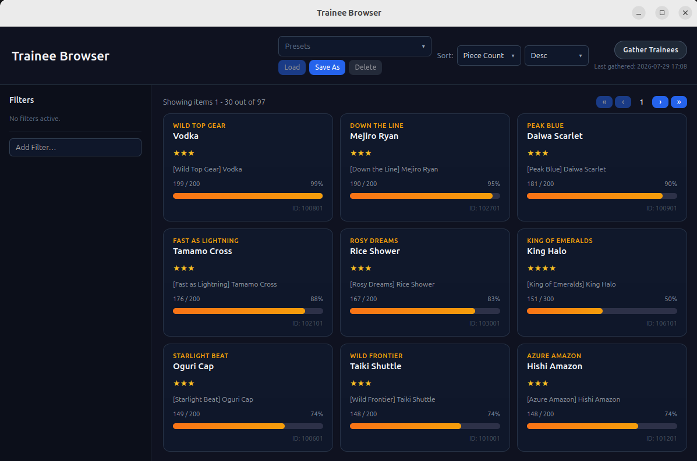
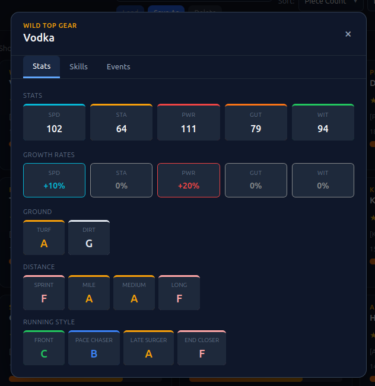
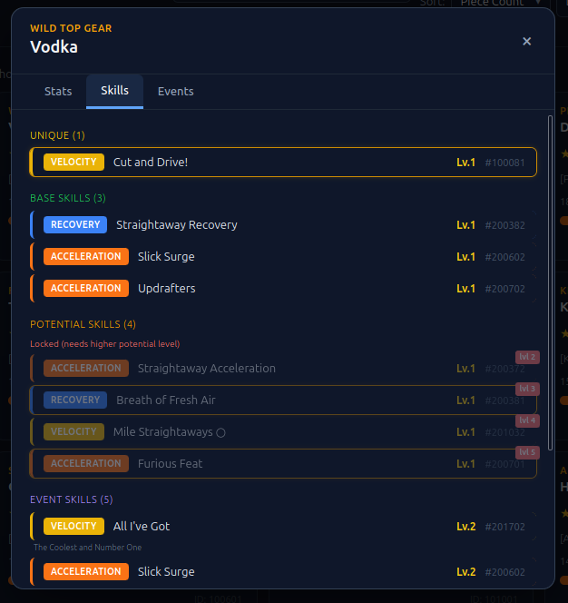
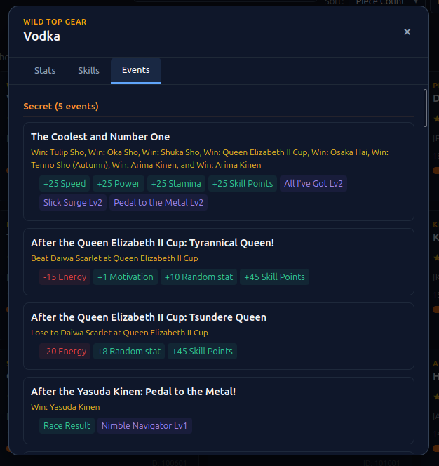

# Trainee Browser

Browse and inspect trainee character data from your game sessions. Track piece progress, growth rates, aptitudes, skills, and events for each trainee.

## Trainee Card

Each trainee card shows a summary of the character:

- **Character variant and name** — the specific trainee variant (e.g. a holiday version) and the base character name
- **Owned rarity** — displayed as star rating (★). Shows "Not owned" if the trainee hasn't been obtained yet
- **Piece progress** — current piece count vs pieces needed for next rarity upgrade, with a visual progress bar. Shows "MAX" if the trainee is fully upgraded
- **Affinity score** — base affinity (character-based) with optional bonus for shared major wins in legacy. Used for legacy planner pairing decisions
- **Trainee ID** — internal database identifier

## Trainee Detail Modal

Clicking a trainee card opens the detail modal with three tabs:

### Stats Tab

Shows the trainee's full stat profile:

- **Growth rates** — Speed, Stamina, Power, Guts, Wisdom growth percentages (e.g. `+10%`, `+0%`)
- **Base stats** — raw stat values at level 1
- **Aptitudes** — color-coded rating cards for each field:
  - **Ground**: Turf, Dirt
  - **Distance**: Sprint, Mile, Medium, Long
  - **Style**: Front Runner, Pace Chaser, Late Surger, End Closer

Aptitude levels are displayed as letter grades (A through H).

### Skills Tab

Skills are grouped by source:

- **Unique** — character-exclusive skills (gold border)
- **Base Skills** — skills the trainee innately learns
- **Potential Skills** — skills unlocked via potential level. Split into:
  - **Unlocked** — available at current potential level
  - **Locked** — requires higher potential level (shows required level badge)
- **Event Skills** — skills obtained through training events

Each skill is a clickable pill that opens the skill detail modal with full information. Event skills also show their source event name.

### Events Tab

Training events grouped by category:

- **Secret** — rare events with high-impact rewards
- **With Choice** — events where you pick between options
- **No Choice** — automatic outcome events
- **Outings** — date/outing events
- **Version** — character version specific events

Each event card shows:
- Event name and any trigger conditions
- Choice branches (with choice index for multi-choice events)
- Probability labels when multiple outcomes exist per choice
- Rewards with color coding — green for positive, red for negative
- Reward types include stat gains, skill acquisition (with level), and other effects

> For the events to be displayed, the Supplementary Data must be synced from remote.
  For more information see [Supplementary Data Sync](main-app-window.md#data-status).

## Filtering

The filter panel provides a selection of filter types. Select one from the dropdown to configure and add it.

### Owned Status

Filter by whether you own the trainee or not. Useful for tracking which characters you still need to acquire.

### Growth Bonus

Filter by minimum growth rate for a specific stat. Select the stat (Speed, Stamina, Power, Guts, or Wisdom) and optionally set a minimum growth percentage. Only trainees with at least that growth rate are shown. With no minimum set, any positive growth rate qualifies.

### Min Aptitude

Filter by minimum aptitude level for a specific category. Select the aptitude field:
- **Ground**: Turf, Dirt
- **Distance**: Sprint, Mile, Medium, Long
- **Style**: Front Runner, Pace Chaser, Late Surger, End Closer

Then choose a minimum level (A through G). Only trainees meeting or exceeding that level are shown.

### Max A Aptitudes

Filter by maximum number of A-rank aptitudes. Set a limit — only trainees with at most that many A-grade aptitudes are shown. Useful for finding trainees with high chance of generating
spark for given aptitude.

### Character

Filter by character name. Search and select a single character to narrow down to that character's trainee variants.

### Has Skill

Filter by whether a trainee has a specific skill. Search and select a skill, then choose which skill sources to include:
- **Innate** — skills the trainee learns by default
- **Event** — skills from training events
- **Secret** — skills from secret events

Toggle source checkboxes on or off to narrow the search. The filter label shows which sources are included (e.g. `[I,E,S]` for all three, `[I]` for innate only).

## Legacy Planner Mode

Trainee Browser can be also entered through [Legacy Planner](legacy-planner.md) - the affinity 
will be then calculated taking into account whole legacy tree already
set in Legacy Planner, providing additional sorting option for affinity.
