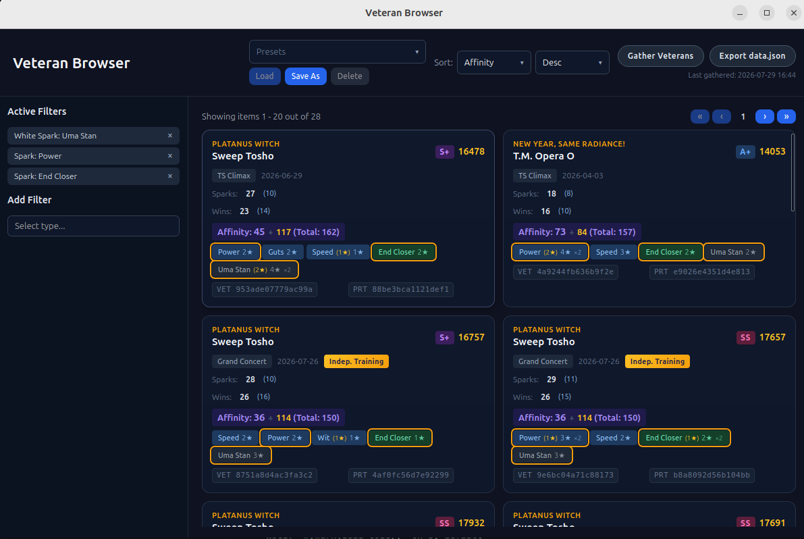
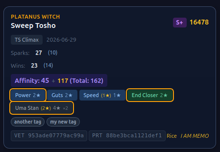
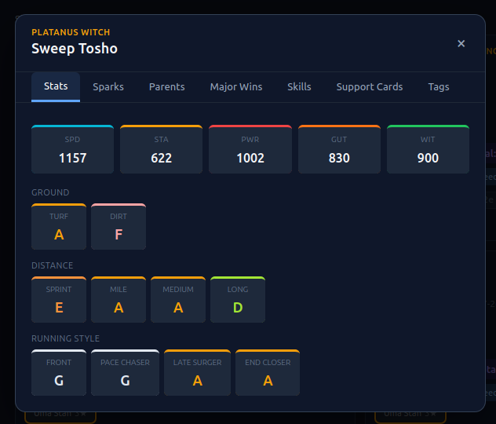
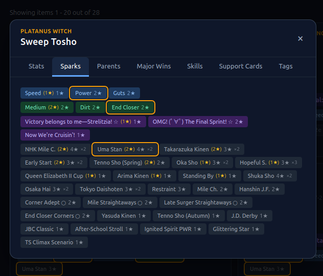
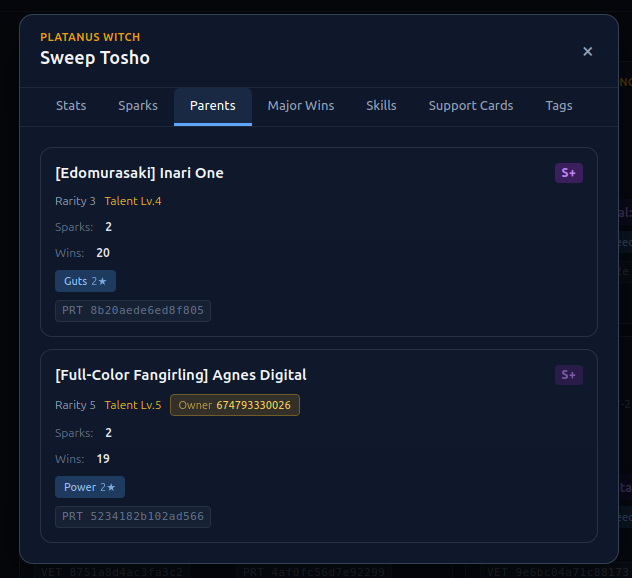
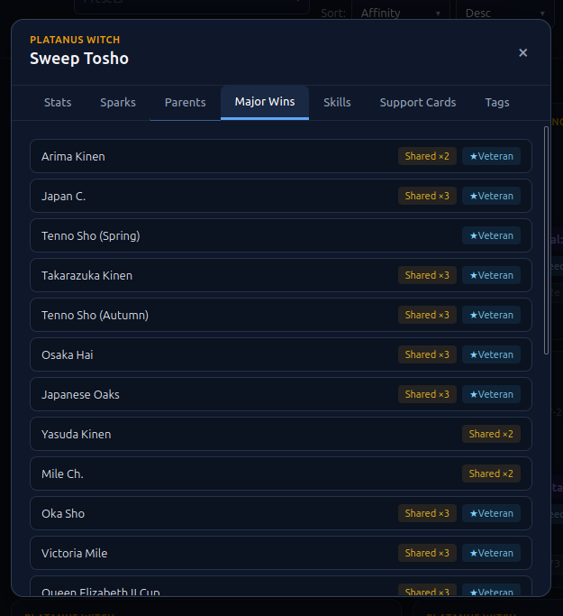
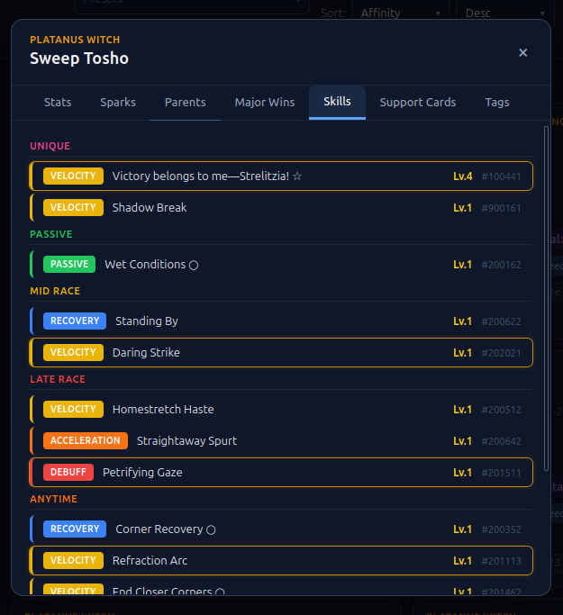
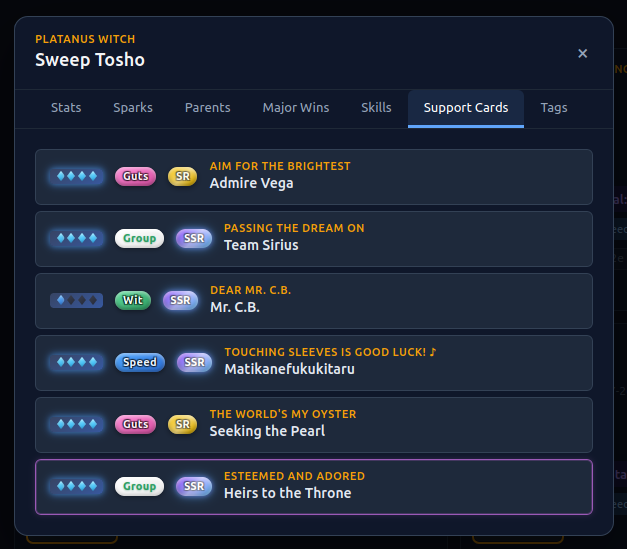
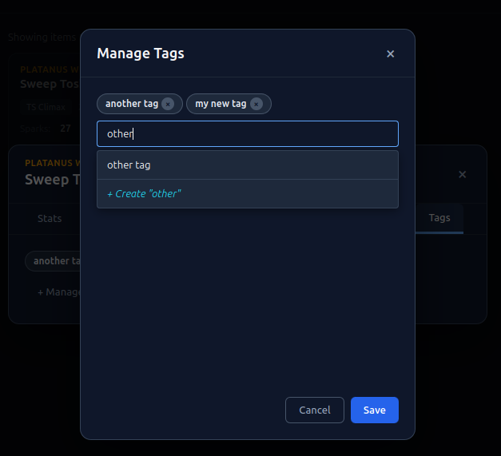

# Veteran Browser

Browse and search your current veteran trainees and borrowed trainees saved into the database.

The view comprises:
- header containing:
    - the sorting options
    - presets manager (for filters and sorts)
    - action buttons:
        - Gather Veterans - sidecar process gathers current veterans from running game process
        - Export JSON - export to json file compatible with [uma.moe](https://uma.moe) and
        other online tools.
- side panel with the active filters indicators and new filter forms
    - select filter type from the list (begin typing to find the correct type easily)
    - after selecting the type, the concrete filter form is shown
- main panel containing veteran cards with basic info
    - veteran cards are clickable, opening the details modal

## Veteran Card

Each veteran card contains some basic information about the veteran:
- trainee variant and character name
- rank, rank score, trained date and scenario on which it was trained
- indicator if veteran was produced by independent training
- number of major wins and white sparks
    - two numbers: distinct total wins/sparks on the whole legacy (veteran + parents) and, 
    in parentheses, the total wins/sparks on the veteran only
- affinity score - base affinity (character-based) plus bonus affinity for shared major wins in legacy
- spark pills - for brevity, only the blue sparks AND sparks matching active filters are shown
- internal tags, if any given
- internal hashes usable in dedicated filters - an 'identifier' of concrete veteran
    - veteran hash - most accurate collision-free, only used for tracking 
    concrete veteran (eg. in Race Dump Viewer)
    - parent hash - less accurate, can be used to track for which other veterans the current
    one has been used as a parent
- in-game favorite icon (if any) and/or memo text (if any).

Additionally, if veteran is saved from uma.moe API - badge with trainer ID and option to remove
the veteran from saved trainees.

For more details, each Veteran Card can be clicked, opening the Veteran Details Modal.

## Veteran Details Modal

Modal contains multiple tabs, each presenting different information about the veteran:

### Stats Tab

Contains veteran stats and aptitudes.

### Sparks Tab

Contains sparks for whole veteran legacy (so on veteran + parents).

Each spark pill contains information about the spark:
- color-coded spark type (stat, aptitude, unique skill, common)
- number of stars for spark on the veteran - in parentheses
- total number of stars for given spark on the whole legacy
- number of trainees in legacy tree containing the given spark (if more than 1)

Given the example in the screenshot, there is a spark for Uma Stan with 2 stars on the veteran,
in total there are 4 stars in the whole legacy, and there are 2 trainees in the legacy tree
having this spark.

### Parents Tab

Brief veteran cards for each parent, clickable for another modal with sparks and major wins on
concrete parent. Parent in-app hash can be copied and used in Veteran Browser filters to search 
for veteran with this parent hash or other veterans with the same parent.

### Major wins tab

Contains information about major wins contributing to the affinity on the given veteran legacy.
Each win can contain additional pills: 
- 'Shared x N' - if given win is shared by multiple trainees in the legacy tree
- 'Veteran' - if given win is present on the veteran

### Skills tab

Contains information about skills learned by the veteran. Each skill is clickable - 
opening the skill details modal.

### Support cards tab

Contains brief information about what support cards have been used during the veteran career.

### Tags tab

Contains list of tags assigned to the veteran (if any). Clicking 'manage tags' opens the tag
management modal, allowing addition and removal of tags.

Tags are internal to the app and can be used in veteran browser filters.

## Filtering

The veteran browser provides a side panel for building complex filter queries. Select a filter type from the list (begin typing to find the correct type quickly). Active filters are shown as removable indicators above the filter form.

If filter can intake multiple values and multiple values are provided, at least one of the
values must match. If you want to match all values, use multiple filters of the same type.

Eg. if you want to find all veterans having at least one of the provided sparks, provide
multiple values to the spark filter. If you want to find all veterans having all of the provided
sparks, use multiple spark filters.

### Hash-based filters

These intake in-app hashes for different positions in the veteran legacy.

- **Veteran Hash**: filter by the internal *Veteran Hash* — a unique, collision-free identifier for a specific veteran. Useful for locating a concrete veteran (e.g. one referenced in a race dump).
- **Parent Hash**: filter by the veteran's *Parent Hash* - less accurate identifier, but derivable
from data which the game stores about parents. Useful if you want to find a veteran which
was used as a parent for another.
- **Has Parent**: search for veterans which have a specific parent by providing the parent hash.

### Character and trainee filters

These filters allow searching by character / trainee variant. Multi-select from the list of options. Supports negation to exclude characters / trainees, and `From Parent` to match characters on the parent side of the legacy rather than the veteran itself.

### Scenario

Filter by the career scenario in which the veteran was produced.

### Rank Score

Filter by rank score range. Set minimum and/or maximum values to narrow down veterans by rating.

### Spark filters

Filter by spark present on the legacy tree. Select spark group then optionally constrain by:

- **Star count** — minimum and/or maximum stars for the spark
- **On trainee** — only match if the spark is present on the veteran itself (not just parents)
- **Min shared umas** — minimum number of trainees in the legacy tree that share this spark

There are separate filters for blue, pink, green and white sparks.

For white sparks you can also filter for 'at least one' of white spark groups by providing 
multiple values.

There is also a filter for white spark count.

### Major Wins filters

Filters by the major wins which are taken into account while calculating affinities
(basically only G1 individual races wins).

You can either filter by the total number of major wins or by specific major win.

### Aptitude

Filter by aptitude level for a specific track, distance, or running style. Select the aptitude field:
- **Ground**: Turf, Dirt
- **Distance**: Sprint, Mile, Medium, Long
- **Style**: Front Runner, Pace Chaser, Late Surger, End Closer

Then choose a minimum level (S through G). Only veterans with at least that aptitude level are shown.

### Favourite memo and icon

Filter veterans that have an in-game favourite icon or a memo set in-game. Optionally provide specific icon type or search text for memo.

### Borrow Status

Filter by borrow status — show only **owned** veterans (trained by you) or **borrowed** veterans (from other trainers via uma.moe).

### Independent Training

Filter by whether the veteran was/was not produced through independent training (not in a regular training session).

### Affinity

Filter by minimum affinity score. Affinity is calculated from character base affinity plus bonus affinity for shared major wins in the legacy.

### Tag

Filter by internal tags assigned to veterans. Tags are user-defined labels that can be managed from the Veteran Details Modal.

### Trainer ID

Filter by trainer ID (for veterans synced from uma.moe API). Enter one or more trainer IDs to find veterans from specific trainers.

## Export

Veterans can be exported in JSON format for use with other tools or sharing. By clicking the export
button, produced JSON will contain data for all current owned veterans gathered by the app.

## API Mode

Veteran browser can be also used in API mode, which allows to query [uma.moe](https://uma.moe)
API for veterans. Not all filters are supported in API mode. In API mode veterans can be
saved to local database which then supports more advanced filters and sorts.

## Legacy Planner Mode

Veteran Browser can be also entered through Legacy Planner - most notable change is that
the affinity will be then calculated taking into account whole legacy tree already
set in Legacy Planner. For more information see [Legacy Planner section](legacy-planner.md).